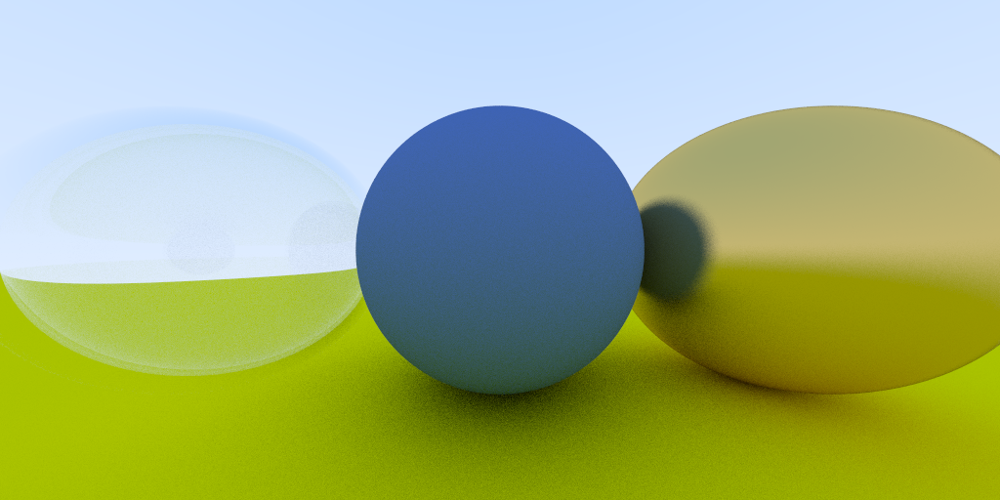

# Ray Tracing in a Weekend in Rust

This is a Rust implementation of the Ray Tracing in a Weekend 
book series by Peter Shirley. The original book series is written in C++.

The goal of this project is to demonstrate how to write idiomatic Rust code,
Rust's memory management, framework, tools, how to work with 
parallelism in Rust, futures, and async/await.

People with C++ background will find this project useful to learn Rust as 
they can compare the C++ code from the book series with the Rust code.

There are probably a plethora of attempts to implement this book series in Rust
available on the internet, but I wanted to do it myself from scratch to avoid 
being spoiled by other implementations.

In the code you will find comments that explain some of the Rust concepts
that I have found interesting to pay attention to. All of them are marked 
with the `// LEARN` comment.

Some parts of the code are intentionally done in not the most simple way,
as the goal is to demonstrate different ways of doing things in Rust.

It takes a while to render the image at a high resolution, even to play with 
positionable camera to have a meaningful image it takes a lot of time.
So the next steps would be to implement parallel execution of the ray tracer to 
use all available CPU cores to speed up the rendering process.

](./result.png)

P.S.

I wish I would check the website of the book before I tried it. 
Because I used some buggy PDF version of it I found over the internet =)

[Ray Tracing in a Weekend](https://raytracing.github.io/books/RayTracingInOneWeekend.html)